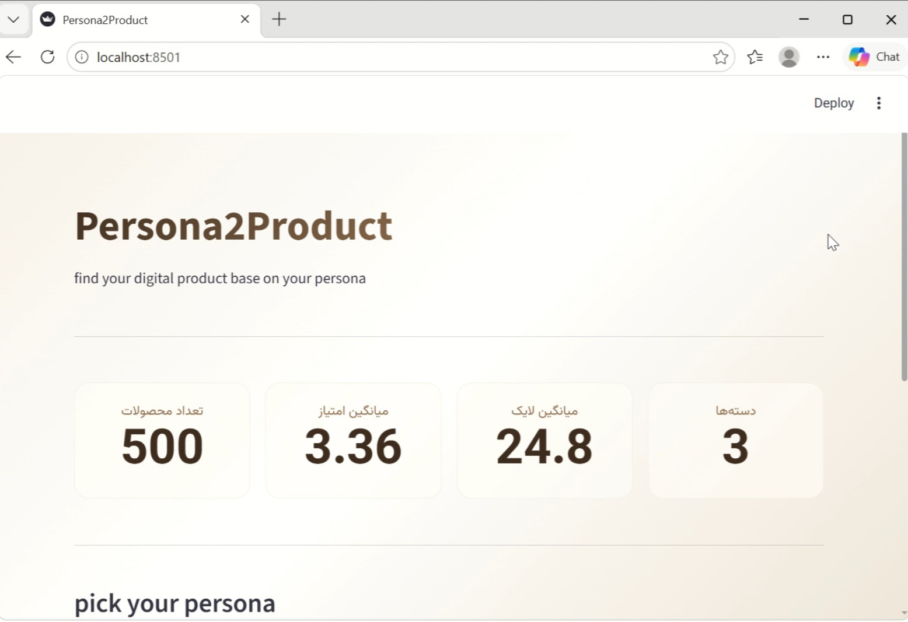

# persona2product
digital product recommender based on your persona

**Persona2Product** is a context-aware recommendation engine built with Streamlit. It moves beyond standard collaborative filtering by matching users to products based on their **shopping persona** (e.g., Brand-Oriented, Budget-Conscious, Performance-Focused). 

The system leverages **Clustering** and an integrated **Reinforcement Learning (RL) loop** to refine recommendations based on user interactions (likes), creating a personalized and adaptive shopping experience.


---

## Table of Contents
- [Features](#features)
- [Tech Stack](#tech-stack)
- [Project Architecture](#project-architecture)
- [Usage](#usage)
- [Customization](#customization)

---

## Features

- **Persona-Based Matching:** Users define their intent (e.g., "Brand-oriented", "Value-for-money"), and the system dynamically maps this preference to the most suitable product cluster.
- **Adaptive Reinforcement Learning (RL):** The system learns from user behavior. When a user "likes" a product, the underlying weights (Price, Rating, Popularity) are dynamically adjusted to surface better recommendations in future sessions.
- **Persistent User Memory:** User interaction history (`user_history.json`) is stored locally, ensuring the system remembers user preferences across browser sessions.
- **Rich & Interactive UI:** Built with a custom-crafted, warm beige aesthetic using HTML/CSS, featuring responsive grids, product cards, and smooth visual transitions.
- **Data Exploration Dashboard:** Built-in analytics tabs displaying key metrics, interactive scatter plots (Plotly), and WordCloud visualizations to explore the product catalog.

---

## Tech Stack

- **Language:** Python 3.9+
- **Web Framework:** [Streamlit](https://streamlit.io/)
- **Data Processing:** Pandas, NumPy
- **Visualization:** Plotly Express, Matplotlib, WordCloud
- **Design:** Custom CSS (inline HTML styling)
- **Persistence:** JSON (local storage)

---

## Project Architecture

The project follows a modular data pipeline to ensure separation of concerns:

1. **Preprocessing**:
   - Reads the raw Excel data.
   - Handles missing values and deduplication.
   - Triggers the Feature Engineering module.
   - Saves the cleaned, feature-rich dataset back to the Excel file.

2. **Feature Engineering**:
   - Encodes categorical price variables into a numerical scale (`price_encoded`).
   - Generates compound scoring metrics (e.g., `weighted_score`, `hotness_score`).
   - Creates normalized columns to assist the RL model.

3. **Recommendation Engine**:
   - **Clustering**: Maps the user's chosen persona to the closest product cluster based on Euclidean distance (price, average rating, likes).
   - **RL Logic**: Maintains a dynamic `weights` dictionary. When a user likes a product, the weights for `rate`, `likes`, and `price` are recalibrated to maximize the score of future recommendations.

---

## Usage
Once the data has been processed, launch the web application:

```bash
streamlit run app.py
```
The application will open in your default web browser at http://localhost:8502.

### How to use the App:
Select your Persona from the dropdown menu (e.g., "Economical", "Performance-Oriented").
Click the "Get Recommendations" button.
Browse the generated product cards.
Click the Heart (🤍) button on any product you like. The system will record this feedback and adjust the RL weights to improve your future recommendations. You can view the updated weights in the "Prediction System Updates" section.

## Customization
### Adding a New Persona:
Open app.py and modify the PERSONAS dictionary. You can define the desired price (0-2), rate (0-5), and likes (`int`) criteria.

### Changing the RL Logic:
If you want to adjust how aggressively the system learns from user likes, modify the `update_weights_based_on_likes` function in app.py.

### Modifying the Visual Theme:
The entire UI styling is controlled via the <style> block inside the `st.markdown` function at the top of app.py. You can change the CSS variables, colors, and layout there.

## About Data
the data was collected by scraping bot I made to scrape products info and comments from Digital category in digikala.com

## demo


.jpg)
.jpg)
.jpg)
.jpg)

or use clone
```bash
git clone https://github.com/sarinanemati/persona2product.git
cd persona2product
```
